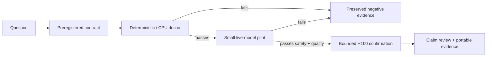

# CoTCodec

**A research harness for measuring the hidden design choices inside tool-using
LLM agents.**

Kevin Liu — Princeton University — 2026<br>
Advisor: Professor Danqi Chen, Princeton NLP Group

[](pyproject.toml)
[](LICENSE)
[](docs/current-state.md)

## Why this exists

Agent systems make consequential choices at every step: what language to use,
what to remember, how far ahead to plan, how much tool output to retain, when
to retry, and when to verify. Frameworks usually hard-code these choices and
then attribute the resulting behavior to the model.

CoTCodec treats each choice as an explicit **orchestration variable**:

```text
π(m_t, x_t) → σ_t ∈ {option_1, …, option_k}
max U(π) = Success − λc·Cost − λt·Latency − λs·SafetyRisk − λm·MonitorabilityCost
```

Paper 1 studies language choice in framework-visible intermediate messages.
Tool schemas, tool calls, received tool results, and final answers remain fixed
in English. The project does not claim to inspect or manipulate hidden chain of
thought.

## Start here

| If you want to… | Read |
|---|---|
| Understand what is true now | [Current research state](docs/current-state.md) |
| Understand the code | [Harness architecture](harness/README.md) |
| Understand the scientific gates | [Evidence and claim model](docs/evidence-model.md) |
| Continue memory research | [Memory handoff](docs/memory-handoff.md) |
| Use the H100 host | [H100 operator runbook](docs/h100-operator-runbook.md) |
| Find a directory or owner | [Repository map](docs/repository-map.md) |
| Run or resume work | [Research operations](docs/research-operations.md) |
| Continue as an agent | [Handoff](HANDOFF.md), then [AGENTS.md](AGENTS.md) |
| Browse all documentation | [Documentation index](docs/README.md) |

## Research program

| Variable | Current role | Canonical direction |
|---|---|---|
| Language | Paper 1, active | [`01-language.md`](directions/01-language.md) |
| Reasoning format | Paper 1/2 bridge | [`02-reasoning-format.md`](directions/02-reasoning-format.md) |
| Memory policy | CPU-first falsification program | [`03-memory-policy.md`](directions/03-memory-policy.md) |
| Context allocation | Planned | [`04-context-allocation.md`](directions/04-context-allocation.md) |
| Observation granularity | Planned | [`05-observation-granularity.md`](directions/05-observation-granularity.md) |
| Planning depth | Planned | [`06-planning-depth.md`](directions/06-planning-depth.md) |
| Retry and recovery | Planned | [`07-retry-recovery.md`](directions/07-retry-recovery.md) |
| Verification cadence | Planned | [`08-verification-cadence.md`](directions/08-verification-cadence.md) |
| Compaction policy | Planned | [`09-compaction-policy.md`](directions/09-compaction-policy.md) |
| Tool scheduling | Future | [`10-tool-scheduling.md`](directions/10-tool-scheduling.md) |
| Delegation topology | Future | [`11-delegation-topology.md`](directions/11-delegation-topology.md) |
| Instruction hierarchy | Future, safety-critical | [`12-instruction-hierarchy.md`](directions/12-instruction-hierarchy.md) |

The complete taxonomy and interaction hypotheses live in
[`directions/README.md`](directions/README.md).

## How evidence moves



Passing an earlier box never implies a later one. A storage lifecycle doctor is
not memory-quality evidence; a deterministic runner admission is not a live
model result; an H100 job is not publication evidence without provenance,
resume, safety, and independent-review gates.

## Quick start

```bash
# Install the locked development environment.
uv sync --extra dev

# Check the local harness and run the test suite.
uv run python scripts/check_harness_env.py
uv run pytest -q
uv run ruff check harness scripts tests

# Validate registered research surfaces without spending model or GPU budget.
uv run python scripts/validate_memory_experiments.py
uv run python scripts/validate_memory_sources.py
uv run python scripts/validate_memory_portfolio.py
```

Experiments are YAML contracts under [`experiments/`](experiments/README.md).
Do not run a full benchmark until its adapter, oracle, trace validation, and
3–5 task pilot are real and passing.

## Repository shape

```text
directions/       Research questions and variable taxonomy
experiments/      Immutable preregistered experiment contracts
harness/          Model-agnostic runner, agent loops, conditions, metrics
infra/            Reproducible local/Slurm/container execution surfaces
models/           Model and provider provenance registries
research/         Sources, audits, scans, portfolio, portable evidence
scripts/          Validators, compilers, runners, analyzers, sealers
tests/            Unit, tamper, lifecycle, evidence, integration gates
wiki/             Project identity and append-only operations timeline
data/             Local raw runs, weights, caches, databases; mostly ignored
```

See [the full repository map](docs/repository-map.md) for ownership boundaries.

## Non-negotiable research rules

- Freeze conditions, tasks, seeds, budgets, and identities before treatment.
- Preserve negative results and pre-result failures; rerun in a new versioned
  output directory.
- Keep raw traces immutable and derived evidence lineage-complete.
- Treat safety as a primary metric.
- Separate interface, transport, lifecycle, component, benchmark, live-model,
  and scientific evidence.
- Do not escalate a killed revision merely to search for a positive result.

The complete operating contract is in [`AGENTS.md`](AGENTS.md).

## License

[MIT](LICENSE). Third-party systems, datasets, papers, and model artifacts keep
their own licenses; their exact provenance is recorded separately.
