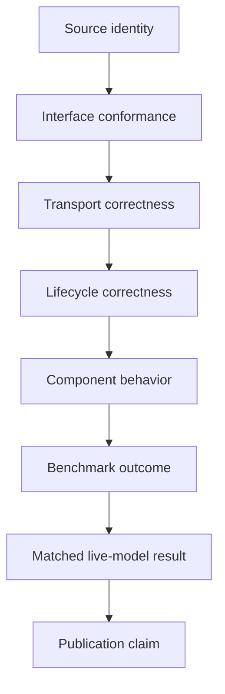

# Evidence and claim model

CoTCodec separates evidence levels because most overclaiming happens when a
valid lower-level result is silently promoted into a higher-level conclusion.

## Evidence ladder

| Level | Establishes | Does not establish |
|---|---|---|
| Source identity | Exact code/license/dependency/image under test | Runtime behavior |
| Interface | Requests and responses have the expected shape | Persistence or correctness |
| Transport | Calls, errors, budgets, and receipts cross boundaries correctly | Task quality |
| Lifecycle | CRUD, restart, isolation, retry, deletion, residue behavior | Useful memory or reasoning |
| Component | One bounded mechanism behaves under controlled inputs | End-to-end agent success |
| Benchmark | Performance on a frozen task/split/oracle | Generalization or causal mechanism |
| Live model | A named model/runtime produced a matched result | Publication readiness |
| Publication | Provenance, controls, safety, statistics, review, and rerun gates pass | Universal truth |

## Required properties of decision evidence

- Immutable source/model/runtime identity
- Preregistered falsifier and claim boundary
- Finite wall-clock, token, dollar, iteration, and GPU-hour budgets
- Raw outputs preserved separately from portable summaries
- Atomic output and fresh-process resume where the workload is long-running
- Explicit incomplete/pre-result classification
- Tamper-evident manifest and independent validation
- Negative evidence retained without score or contract rescue

## Status vocabulary

- **pre-result** — execution never reached the treatment.
- **incomplete** — treatment began but the registered decision could not be made.
- **unexpected status** — a well-formed run disagreed with preregistered checks.
- **admission pass** — one lower-level gate permits the next named gate.
- **killed / actor-blocked** — the pinned revision may not escalate to its named
  next gate without a separately preregistered repair or newer revision.
- **scientific result** — a valid benchmark/model comparison inside its claim
  boundary; this is rare and must be explicit.

No code path should infer a stronger term from a weaker one.
