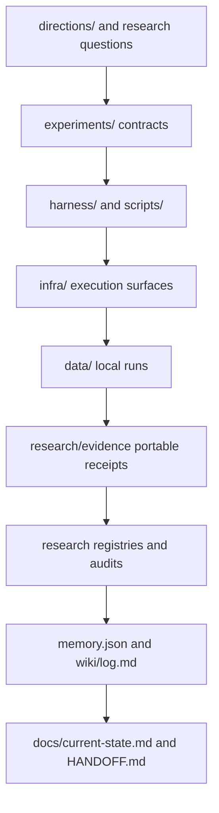

# Repository map

CoTCodec separates scientific contracts, execution code, retained evidence, and
compiled project state. The separation is deliberate: a result should remain
auditable without treating an operator transcript as canonical state.

## Top-level ownership

| Path | Owns | Must not become |
|---|---|---|
| `directions/` | Orchestration-variable hypotheses and boundaries | A run log |
| `experiments/` | Immutable, validated experimental contracts | Ad hoc shell parameters |
| `harness/` | Model-agnostic execution, traces, metrics, and routing | Provider-specific research claims |
| `infra/` | Reproducible runtime and scheduler surfaces | The scientific source of truth |
| `scripts/` | Validators, doctors, sealers, analysis, and operations | Unreceipted one-off patches |
| `tests/` | Contract, invariance, tamper, and regression tests | Evidence of model quality |
| `data/` | Large local inputs, traces, caches, and run directories | A Git staging surface |
| `research/evidence/` | Portable, hash-bound evidence receipts | Raw multi-gigabyte run storage |
| `research/*.yaml` | Source and experiment ledgers | Claims unsupported by receipts |
| `research/*audit*.md` | Human-readable interpretation of a sealed result | A replacement for machine validation |
| `memory.json` | Compiled current project state and queue | An append-only log |
| `wiki/log.md` | Append-only operational and evidence timeline | Compiled current truth |
| `docs/` | Human navigation and operating context | Duplicate implementation manuals |

## Local instructions

The root [`AGENTS.md`](../AGENTS.md) defines project-wide research rules. The
nearest `SKILL.md` adds directory-specific commands and invariants. Generated
Agent-Docs state lives under `.agent-docs/`; its doctor checks instruction
coverage, freshness, and unresolved placeholders.

## Where a completed result goes

1. Raw execution remains under `data/results/` locally or in the versioned
   remote run directory.
2. A sealer validates the manifest and embeds the bounded portable artifacts in
   `research/evidence/`.
3. The matching audit explains the result and its claim boundary.
4. Source and portfolio registries are updated only after their validators pass.
5. `memory.json`, `wiki/log.md`, `docs/current-state.md`, and `HANDOFF.md` are
   refreshed so the next session does not depend on chat history.
