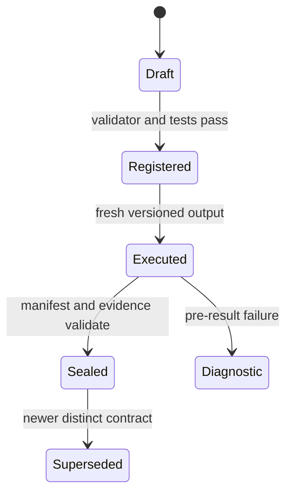

# Experiment contracts

Every YAML file in this directory is a preregistered execution contract. It is
the machine-readable boundary between a research question and a run.

## Required semantics

A contract should identify:

- the exact source, model, benchmark, and immutable revisions under test;
- the intervention and the surfaces held fixed;
- positive controls and explicit falsifiers;
- repetitions, seeds, budgets, resource class, and stop conditions;
- metrics and expected evidence artifacts;
- safety and admission decisions;
- the claim boundary and the next admissible gate.

Every nontrivial contract has a validator under `scripts/` and focused tamper
tests under `tests/`. Validation occurs before staging or scheduling.

## Lifecycle



Do not edit a contract to make an existing output pass. A material change to
source, intervention, expected checks, instrumentation, or claim boundary is a
new versioned attempt with a new output path. Historical failures remain
available and precisely labeled.

## Main groups

- `memory/` contains CPU-first source and lifecycle gates.
- `architectures/` contains model-architecture experiments that may require GPU
  admission.
- root OrchVar YAML files contain deterministic, CPU, and live-model harness
  gates for message transport and loop topology.

Run repository-wide contract validation with:

```bash
uv run python scripts/validate_memory_experiments.py
uv run python scripts/validate_memory_sources.py
uv run python scripts/validate_memory_portfolio.py
```
