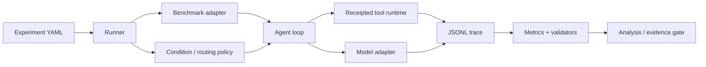

# Evaluation harness

The harness is the experimental instrument. It keeps orchestration conditions,
tool execution, model/provider adapters, trace collection, and analysis
separable so a model can be swapped without changing the scientific question.



## Components

- `runner.py` loads a validated experiment and owns execution boundaries.
- `benchmarks/` supplies tasks, tools, and deterministic success oracles.
- `conditions/` transforms only the framework-visible message types named by
  the intervention.
- `agent_loop.py`, `iterative_agent_loop.py`, and `two_stage_agent_loop.py`
  implement explicit loop topologies rather than hiding them in prompts.
- `receipted_tool_runtime.py` records tool calls, results, ordering, and failures.
- `run_state.py` owns resumable state and provenance.
- `metrics/` collects per-step values and performs registered comparisons.
- `routing/` contains feature extraction and learned/deterministic policies.

## Paper 1 intervention boundary

Only framework-visible intermediate messages vary. Tool names, schemas,
arguments, received tool outputs, and final user responses remain in English.
CoTCodec does not claim access to hidden chain of thought. Trace classification
must distinguish planner notes, handoffs, memory updates, retry diagnoses,
coordinator messages, tool calls, tool results, and final responses.

## Invariants

- Adapter and condition registration is explicit and model-agnostic.
- Every tool action is executed once unless the loop records a deliberate retry.
- Resume is admitted only when a fresh process reproduces the uninterrupted
  continuation at the registered comparison boundary.
- Cost, latency, billed tokens, tool accuracy, task success, safety, and raw
  trace metadata are collected together.
- A unit test, deterministic canary, and live-model result are different
  evidence grades and stay labeled as such.

## Developer checks

```bash
uv run pytest -q tests/test_runner.py tests/test_agent_loop.py
uv run pytest -q tests/test_live_runner.py tests/test_iterative_live_runner.py
uv run ruff check harness tests
```

Read the nearest `SKILL.md` before editing a subsystem. Experiment operation is
documented in [`docs/research-operations.md`](../docs/research-operations.md).
