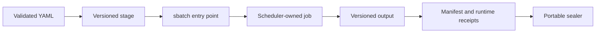

# Infrastructure

Infrastructure turns registered experiment contracts into receipted executions.
It does not decide what the evidence means.

## Execution classes

| Class | Typical use | Admission requirement |
|---|---|---|
| Local process | validators, unit tests, analyses | deterministic inputs |
| Local container | lifecycle and environment smoke tests | pinned image/build inputs |
| Slurm CPU | exact-source lifecycle doctors and restart tests | validated contract and fresh output path |
| Slurm GPU | bounded live-model or architecture cells | all cheaper gates pass first |

## Layout

- `infra/slurm/host-single-node/` contains resource-specific batch entry points.
- `infra/memory-baselines/` contains exact-source lifecycle doctor surfaces.
- `infra/h100/` and related directories contain GPU-specific execution assets
  only where a contract has passed admission.
- `scripts/tmux-research-session.sh` creates a durable operator shell; it is not
  a compute checkpoint.

## Slurm rules

- Match `--cpus-per-task`, memory, time, partition, and GRES to the registered
  YAML. CPU jobs request no GRES and must observe zero GPUs.
- Bind every staged code file with SHA-256 environment variables and verify
  those hashes before the scientific phase.
- Use a new output directory for every job. An existing directory is evidence,
  not a scratch target.
- Record job ID, scheduler allocation, container network mode, visible devices,
  provider-call count, and model-call count in the final report.
- Keep heavy work off the login node.

## Containers and provenance

Prefer digest-pinned images and exact Git revisions. A source archive receipt
includes repository, commit, tree, byte size, and SHA-256. If the official image
is part of the claim, hash-match the relevant files inside the image to the
exact source tree. Dependency locks and remote code are independently reviewed;
a successful image pull is not reconstruction provenance.

Network-disabled jobs must stage all required inputs before submission. Do not
inject provider secrets into a provider-free doctor. Use read-only roots and
non-root execution where the upstream surface permits it, and document any
exception.

## Durability

`tmux` survives an SSH disconnect but not a login-node reboot or scheduler
cancellation. Submitted jobs continue under Slurm. Scientific recovery comes
from atomic, validated checkpoints on persistent storage, never from an
attached terminal or node-local `/tmp`.

## Current H100 host boundary

The dedicated host currently has eight H100 80GB GPUs and a working bounded
Docker lane, but Slurm 21.08.5 cannot enforce the host's unified cgroup-v2
device boundary and Pyxis is absent. Treat
`scripts/submit_docker_research_job.py` as discovery-only and do not use the
generic `scripts/submit_research_job.py` publication path until the upgrade and
isolation doctors in
[`docs/h100-operator-runbook.md`](../docs/h100-operator-runbook.md) pass.

## Outputs

Raw runs remain in versioned local or remote result directories. A complete run
contains its contract, executed code, source/image/runtime receipts, phase
outputs, logs, report, and manifest. Only a validated bounded projection is
sealed under `research/evidence/`; see [`docs/data-policy.md`](../docs/data-policy.md).
