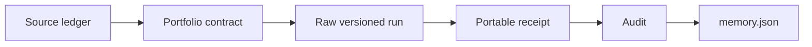

# Research records

This directory connects external sources and executed contracts to auditable
project claims.

## Surfaces

| Path | Purpose |
|---|---|
| `memory-sources.yaml` | Revision-specific source ledger and evidence grade |
| `memory-experiment-portfolio.yaml` | Registered queue, dependencies, outcomes, and admission |
| `evidence/` | Portable machine-validated receipts |
| `*-audit-*.md` | Human-readable interpretation of sealed results |
| `scans/` | Dated frontier-research scans |
| `frontier-research-spec.md` | Coverage, cadence, and escalation rules |
| proposal/evidence directories | Gauntlet contracts and hashed review bundles |

## Evidence discipline

A source entry records what a repository or paper implements; it does not imply
that CoTCodec reproduced its claims. A portfolio entry records an experiment's
state; it does not imply scientific or publication readiness. A portable receipt
binds a bounded executed result; it does not widen the contract's claim boundary.



Negative evidence is retained and promoted when the preregistered controls and
falsifier ran correctly. Launch errors and instrumentation defects remain
diagnostics. A lifecycle negative can forbid a revision from an H100 quality
cell without saying anything about the system's semantic memory quality.

## Validation

```bash
uv run python scripts/validate_memory_sources.py
uv run python scripts/validate_memory_portfolio.py
uv run pytest -q tests/test_memory_sources.py tests/test_memory_portfolio.py
```

See [`docs/evidence-model.md`](../docs/evidence-model.md) for the claim hierarchy
and [`docs/current-state.md`](../docs/current-state.md) for the active queue.
